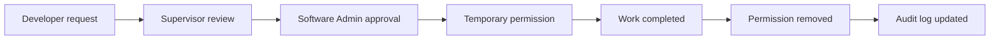

# OGEDAY GitLab Operational Model

This document adapts the self-hosted GitLab structure from the OGEDAY planning PDF to the current `ogedays.com` repository.

## Operating principle

GitLab is not only a code host for OGEDAY. It should become the operational control layer for tasks, approvals, access requests, review history, deployment evidence, and audit trails.

The first implementation for this repo is intentionally small:

- Every change starts from a task or access request.
- Every merge request explains purpose, scope, risk, test result, and rollback.
- Sensitive files require explicit owner review.
- Temporary access is requested through an issue template and removed after expiry.
- Production deploys use a release checklist before action is taken.
- CI checks the public site contract and the presence of governance files.

## Layers

### 1. GitLab Core

This layer provides the basic repository workflow:

- Repository and protected branches
- Merge requests
- Issue templates
- CI pipelines
- CODEOWNERS
- Audit-friendly history

### 2. OGEDAY Operational Layer

This layer defines how the team actually works:

- Role boundaries
- Need-to-know access
- Temporary permission workflow
- Supervisor review
- Software Admin approval
- Task-driven development
- QA validation before deploy
- Release checklist before production change
- Incident handling and emergency access review

## Roles

### CEO / Founder

Owns strategic visibility and final authority. This role should see progress, risk, and release state without needing day-to-day repository access to every technical detail.

### Software Admin

Owns GitLab configuration, protected branches, deploy keys, runner settings, production access, and emergency recovery.

### Supervisor

Reviews task scope, validates business need, controls access request justification, and confirms that work is ready for technical review.

### Frontend Developer

Works on site UI, static assets, content, accessibility, SEO, and browser validation.

### Backend / DevOps Developer

Works on server, nginx, deployment, automation, infrastructure, and operational scripts.

### QA / Test

Validates user-facing behavior, release readiness, regression state, mobile behavior, and post-deploy evidence.

## Access request flow

Use `.gitlab/issue_templates/Access_Request.md` for restricted resources.

Temporary access should be used for:

- Production logs
- Critical branches
- Deployment areas
- Server configuration
- DNS and TLS records
- Environment variables
- Runner and CI settings

## Merge request discipline

No taskless merge request should be accepted. A valid MR must include:

- Linked issue
- Purpose
- Scope
- Risk level
- Test result
- Deploy notes
- Rollback plan
- Supervisor review checklist

## Branch and deployment policy

Recommended protected branch rules for GitLab:

- `main` is protected.
- Direct push to `main` is disabled.
- Merge requires a passing pipeline.
- Sensitive paths use CODEOWNERS approval.
- Production deploy access is limited to Software Admin.

The current repo does not include an automatic production deploy job yet. That should be added only after GitLab runners, SSH keys, environment variables, and rollback flow are tested.

## Audit categories

Track these categories through issues, merge requests, pipeline logs, and admin audit logs:

- Repository changes
- Merge request approvals
- Permission changes
- Deployment actions
- System and runner changes
- Access request lifecycle
- Incident reports
- Backup and restore tests

During the pilot, important events can also be summarized in `docs/gitlab/audit-register.md` so the team can review patterns before building automation.

## First 6-7 months

The first months should be treated as an operational data collection period. The goal is to observe how work actually moves, where access requests repeat, where approvals slow down, and which validations catch real problems.

Do not over-automate too early. Start with simple templates and CI checks, then convert repeated manual decisions into automation.
